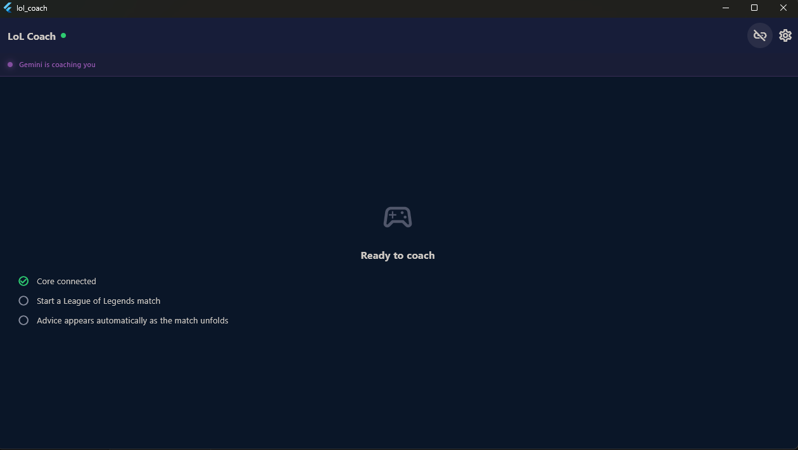
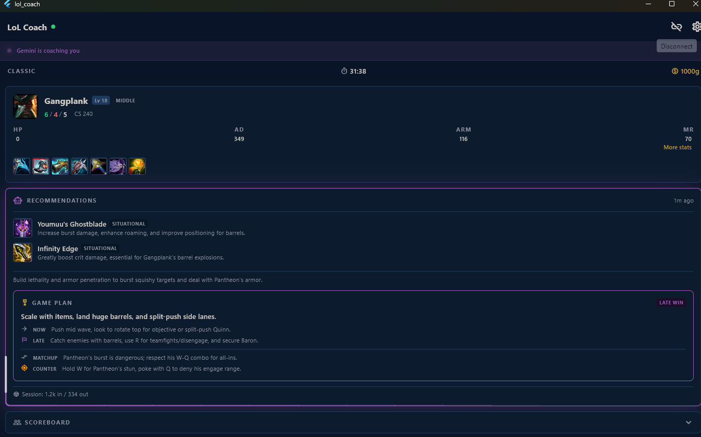

# LoL Coach

[](https://github.com/NexusHero/LOLRecommender/actions/workflows/ci.yml)
[](LICENSE)
[](https://flutter.dev)
[](https://nodejs.org)
[](https://www.typescriptlang.org)

> **Real-time AI coaching overlay for League of Legends — runs entirely on your machine, no account required.**

| Off-game (ready to coach) | In-game (active session) |
|---|---|
|  |  |

An AI-powered in-game coaching assistant for League of Legends. A local Node.js core backend reads live game data from the Riot Games Live Client API and streams real-time recommendations to a Flutter desktop app over WebSocket.

The coaching engine combines a rule-based heuristic (zero latency, no internet) with an optional LLM layer (Claude, OpenAI, or Gemini) that produces role-aware, matchup-specific advice — not generic tips.

---

## Why LoL Coach?

| | LoL Coach | Generic tier-list sites | In-client coach |
| --- | --- | --- | --- |
| Reads your **live** game state | ✅ | ❌ | ✅ |
| Role-aware advice | ✅ | ❌ | partial |
| Lane matchup analysis vs. your actual opponent | ✅ | ❌ | ❌ |
| Runs **offline** (heuristic mode) | ✅ | ❌ | ✅ |
| Works on a second screen / phone | ✅ | — | ❌ |
| Open source, no account | ✅ | ❌ | ❌ |

---

## Quick start

```bash
# 1. Core (run on the same PC as League)
cd core && npm install && npm run dev

# 2. Desktop app (macOS / Windows / Linux)
cd app && flutter pub get && flutter run
```

Open **Settings**, enter your Summoner Name and optionally an LLM API key, then start a game.

---

---

## What it does

- **Role-aware strategy** — advice adapts to your role. A support gets vision-score feedback and ADC-protection cues; a Tryndamere top gets split-push timing, not "group for teamfights".
- **Lane matchup analysis** — compares your CS, KDA, level and items against your specific lane opponent in real time.
- **Concrete counter-play** — one actionable sentence: what to do *right now* against this specific champion.
- **Counter-item recommendations** — flags Grievous Wounds, Banshee's Veil, QSS, or Randuin's based on the enemy composition across all 170+ champions.
- **Multi-provider AI** — plug in your own Claude, OpenAI, or Gemini API key, or run heuristic-only with no key required.
- **Trigger on events** — recommendations fire on `GAME_STARTED`, `ITEM_PURCHASED`, `PLAYER_DIED`, and on manual request via the in-app FAB.

---

## Architecture

```
┌──────────────────────────────────────────────────────────┐
│                     Your PC (in-game)                    │
│                                                          │
│  LoL Client  ──►  Riot Live Client API (port 2999)       │
│                            │                             │
│                            ▼                             │
│              Node.js Core (TypeScript)                   │
│          ┌─────────────────────────────────┐             │
│          │  Poller → Parser → EventDetector│             │
│          │  Heuristic Engine               │             │
│          │  StateMinifier                  │             │
│          │  LLM Provider (Claude/OpenAI/..)│             │
│          │  WebSocket Server (port 8765)   │             │
│          └─────────────────────────────────┘             │
└──────────────────────────────────────────────────────────┘
                            │  WebSocket (LAN)
                            ▼
              ┌─────────────────────────┐
              │  Flutter Desktop App    │
              │  Live scoreboard        │
              │  Counter-item picks     │
              │  Lane matchup analysis  │
              │  Role-specific strategy │
              │  Settings & Connection  │
              └─────────────────────────┘
```

| Component | Tech |
|-----------|------|
| Core | Node.js 18+, TypeScript, Zod, ws, tsyringe (DI), @anthropic-ai/sdk, openai, @google/genai |
| Desktop app | Flutter 3.x, Dart, flutter_riverpod (DI/state), web_socket_channel, flutter_secure_storage, shared_preferences |
| Tests | Jest + ts-jest (core), flutter_test (app) |

> **Architecture documentation:** a full [arc42 architecture document](docs/architecture.md) covers the building blocks, runtime scenarios, and decisions. Diagrams are authored in **PlantUML** (`docs/umls/*.puml`, rendered to `*.svg`) and include sequence diagrams for the recommendation pipeline, the WebSocket auth handshake, and the tsyringe DI bootstrap.

---

## Prerequisites

- Node.js 18+
- Flutter SDK 3.4+
- League of Legends installed (the core backend reads from the local Live Client API)

---

## Setup

### 1. Core

```bash
cd core
npm install
```

Start the core backend:
```bash
npm run dev        # development (watch mode)
npm start          # production (requires npm run build first)
```

The core backend waits for an active game. Once detected it starts pushing game state and recommendations over WebSocket.

### 2. Flutter app

```bash
cd app
flutter pub get
flutter run
```

In the **Settings** tab configure:
- Your Summoner Name
- The Core IP and Port (default `127.0.0.1:8765`)
- Your LLM Provider (None, Claude, OpenAI, or Gemini) and API Key

Settings are persisted locally via `shared_preferences`. Once connected the app switches to the **Coach** tab automatically.

---

## How it works

1. **Polling** — The core polls `https://127.0.0.1:2999/liveclientdata/allgamedata` every second.
2. **Event detection** — `EventDetector` compares consecutive snapshots and emits typed events.
3. **Heuristic recommendations** — On each trigger event, `buildCompProfile` analyses the enemy team across 170+ categorised champions and recommends counter-items instantly.
4. **State minification** — Before calling the LLM, `StateMinifier` distils the game snapshot to CS, vision score, KDA, position, gold and live status for every player — minimising token cost while keeping all coaching-relevant data.
5. **Role-aware LLM analysis** — The LLM receives the minified state, the player's role, their lane opponent's stats, and role-specific instructions. It returns a structured JSON with `winCondition`, `immediateAction`, `lateGamePlan`, `laneMatchupAnalysis` and `counterPlay`.
6. **WebSocket broadcast** — Events and recommendations are pushed to all connected Flutter clients as JSON.
7. **Session token budget** — An optional input-token cap (*Session Token Budget* in Settings; default: unlimited) guards against runaway API spend. Once the cumulative session input-token count reaches the cap, the core emits `LLM_BUDGET_EXCEEDED`, heuristic recommendations continue to fire, and the token-usage progress bar in the Recommendation panel turns red. The budget resets when a new game session starts.
8. **Local-only security** — The core binds to `127.0.0.1` and verifies every WebSocket upgrade with a shared secret auto-generated at `~/.lolcoach/.secret`. The Flutter app reads the same file from disk; connections from other machines or without the correct token are rejected.

---

## Project structure

```
lolclient/
├── core/                     # Backend (Node.js/TypeScript)
│   ├── src/
│   │   ├── types.ts          # Zod schemas + TypeScript types
│   │   ├── poller.ts         # Live Client API polling
│   │   ├── parser.ts         # Raw data → ParsedGameState
│   │   ├── eventDetector.ts  # State-change event detection
│   │   ├── stateMinifier.ts  # Token optimisation for LLM
│   │   ├── heuristic.ts      # Rule-based item recommendations
│   │   ├── llmProvider.ts    # AI factory + prompt builder
│   │   ├── orchestrator.ts   # Wires events → recommendations → broadcast
│   │   ├── wsServer.ts       # WebSocket server
│   │   ├── data/
│   │   │   ├── champions.json  # AP / CC / healer classification (~170 champs)
│   │   │   └── items.json      # Item ID → name mapping
│   │   └── index.ts          # Entry point / DI wiring
│   └── src/__tests__/        # Jest unit + integration + E2E tests
│
├── app/                      # UI (Flutter)
│   ├── lib/
│   │   ├── models/           # Data models (Strategy, ItemRecommendation, …)
│   │   ├── services/         # CoachService + WsClient (ChangeNotifier)
│   │   ├── providers.dart    # riverpod provider definitions (DI / lifecycle)
│   │   ├── screens/          # MainScreen, HomeScreen (Coach tab)
│   │   └── widgets/          # RecommendationPanel, GameView, ConnectionForm
│   └── test/                 # Widget, unit and golden tests
│
├── skills/                   # Agent Skills
│   ├── lolcoach-agents/      # Primary vendor-neutral skill
│   ├── lolcoach-claude/      # Claude-specific rules
│   └── lolcoach-gemini/      # Gemini-specific rules
│
└── deployment/               # Build & packaging scripts
    ├── build_unix.sh         # macOS + Linux build script
    └── build_installer.ps1   # Windows MSIX build script
```

---

## Running tests

### All-in-one script (`test.sh`)

```bash
./test.sh                    # core + app (goldens excluded)
./test.sh --coverage         # core tests with coverage report
./test.sh --goldens          # include app golden pixel tests
./test.sh --update-goldens   # regenerate golden baselines, then run all
./test.sh --core-only        # skip app
./test.sh --app-only         # skip core
./test.sh --watch            # jest watch mode (app skipped)
```


#### Mutation testing (Stryker)

```bash
cd core
npx stryker run
# Report: core/reports/mutation/report.html
```

### Flutter only

```bash
cd app
flutter test                                              # unit + widget tests
flutter test --update-goldens test/widgets/recommendation_panel_golden_test.dart
                                                          # regenerate golden baselines
```

> **Golden tests** require a baseline PNG committed under `app/test/goldens/`.
> Run `--update-goldens` once and commit the generated files before golden tests will pass.

---

## AI-assisted development

This project is set up with agent skills to enforce architecture and quality rules for all AI assistants.

### Project skills (slash commands)

Skills live in `.claude/commands/` and are committed to the repo, so every contributor gets them automatically.

| Skill | What it does |
|-------|-------------|
| `/test` | Runs the full suite — `flutter analyze` → app tests → core tests. Accepts the same flags as `test.sh` (e.g. `/test --app-only`). |

### Pre-commit hook

The hook runs `flutter analyze` before every commit that touches `app/` (~4 s). It mirrors the CI analyze step so lint errors never reach the pipeline.

After a fresh clone, install it once:

```bash
cp scripts/hooks/pre-commit .git/hooks/pre-commit
chmod +x .git/hooks/pre-commit
```

> The hook is intentionally lightweight. It only runs analyze, not the full test suite, so commits stay fast.

### Conventions (auto-applied by AI assistants)

All rules live in the [`lolcoach-agents` skill](skills/lolcoach-agents/SKILL.md) under **Conventions**. AI assistants apply them without being asked.

| Rule | Detail |
|------|--------|
| **Commit messages** | [Conventional Commits](https://www.conventionalcommits.org) in English — `type(scope): summary` |
| **Test names** | Microsoft naming — `Subject_StateUnderTest_ExpectedBehaviour` |
| **Test structure** | AAA pattern — Arrange / Act / Assert with a blank line between each phase |

### Agent context skills

| File | Purpose |
|------|---------|
| [`lolcoach-agents`](skills/lolcoach-agents/SKILL.md) | Vendor-neutral context — architecture, conventions, quality gates. Read by all AI assistants. |
| [`lolcoach-claude`](skills/lolcoach-claude/SKILL.md) | Claude-specific settings — model defaults, response style, commit rules. |
| [`lolcoach-gemini`](skills/lolcoach-gemini/SKILL.md) | Gemini-specific overrides. |

---

## License

[MIT](LICENSE) © 2025 Suhay Sevinc
