<!-- arc42, the template for documentation of software and system architecture.
     Template Version 9.0-EN (based upon AsciiDoc version), July 2025
     Created, maintained and © by Dr. Peter Hruschka, Dr. Gernot Starke and contributors.
     See https://arc42.org -->

---

# Introduction and Goals {#section-introduction-and-goals}

## Requirements Overview {#_requirements_overview}

**LoL Coach** is an AI-assisted item advisor for *League of Legends*. The system reads real-time game data from the local Riot Games Live Client API during an active match, detects game-relevant events, and provides the player with context-aware item recommendations generated by an LLM (Claude, OpenAI, or Gemini). Without a configured provider the app still shows live game state and the scoreboard; item advice requires an LLM provider.

**The problem:** During a game, players must decide which items to purchase under significant time pressure. The optimal choice depends on the enemy team composition (AP/AD ratio, crowd control density, healing champions) — a decision that overwhelms less experienced players.

**Essential functional requirements:**

| # | Requirement |
|---|-------------|
| F1 | Poll the Riot Live Client API every 1 second |
| F2 | Detect game-relevant events (GAME_STARTED, ITEM_PURCHASED, PLAYER_DIED) |
| F3 | LLM-based item recommendations (role- and matchup-aware) via a configurable provider |
| F4 | Control API costs through a response cache, a session token budget, and a cooldown mechanism |
| F5 | Real-time push to the Flutter desktop app via WebSocket |
| F6 | Secure storage of API keys in the OS keychain |
| F7 | Support for Windows, macOS, and Linux |

## Quality Goals {#_quality_goals}

The following table lists the top quality goals for this architecture, prioritised by their impact on architectural decisions (based on ISO 25010):

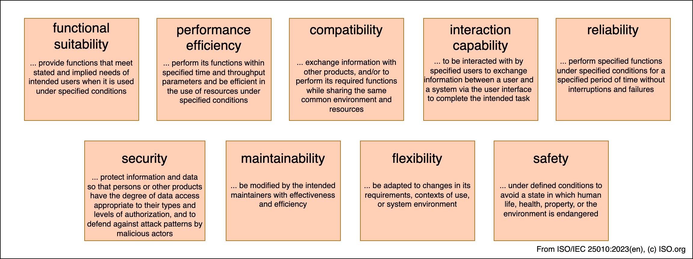

| Priority | Quality Attribute | Goal |
|----------|------------------|------|
| 1 | **Reliability / Graceful Degradation** | Live game state is always shown; an LLM failure or missing provider degrades to "no advice" without crashing |
| 2 | **Performance Efficiency** | Live game-state updates rendered at loopback latency (< 1 ms); LLM advice in < 3 s |
| 3 | **Security** | API keys are stored in the OS keychain, never as plaintext on the filesystem |
| 4 | **Maintainability** | Champion and item data can be updated without a code deployment |
| 5 | **Testability** | All core components are covered by unit tests; dependencies are injectable |

## Stakeholders {#_stakeholders}

| Role | Contact | Expectations |
|------|---------|--------------|
| **Player (End User)** | Community / GitHub Issues | Fast, understandable item recommendations during gameplay; no manual setup required |
| **Developer** | GitHub Repository | Clear component structure, easy extensibility for new LLM providers; full test coverage |
| **Self-Hosting Operator** | GitHub Releases | Simple installation as a self-contained `.exe`/`.app` with no external runtime dependencies |
| **Open-Source Community** | GitHub Pull Requests | MIT license; no GPL/AGPL dependencies; clean CI/CD pipeline |

---

# Architecture Constraints {#section-architecture-constraints}

## Technical Constraints

| Constraint | Background |
|-----------|------------|
| Riot Live Client API runs on `https://127.0.0.1:2999` with a self-signed certificate | The API is an undocumented local HTTP server embedded in the LoL client. TLS verification must be disabled for this specific endpoint. |
| The Bridge must be distributable as a standalone executable | End users have no Node.js runtime installed. The bundle is compiled into a native binary using `@yao-pkg/pkg`, embedding the full Node.js runtime (~50 MB). |
| The Flutter app must run on Windows, macOS, and Linux | Desktop-only; mobile support is not planned. Requires Flutter 3.x or later for desktop targets. |
| LLM API calls incur costs | The architecture must enforce a cooldown mechanism (default: 7 minutes) and minimise token usage through state minification (~4,000 → ~200 characters). |
| No persistent backend infrastructure | The entire system runs locally on the player's machine. No cloud backend, no database, no telemetry. |
| webpack must be configured with `minimize: false` | Compatibility requirement of `@yao-pkg/pkg` when embedding the bundle in the native binary. |

## Organisational Constraints

| Constraint | Background |
|-----------|------------|
| Open-source project (MIT license) | All dependencies must be MIT-compatible. GPL/AGPL are excluded and enforced by `license-checker-rseidelsohn` in CI. |
| CI/CD via GitHub Actions | Security scan (`npm audit`), license check, build pipeline, and test suite run automatically on every push and pull request. |
| No dedicated ops team | The architecture must be low-maintenance; no centralised monitoring is planned. |
| No Riot API key required | The system uses only the local Live Client API (port 2999), which requires no official API key. |

## Conventions

| Convention | Application |
|-----------|-------------|
| Conventional Commits | All git commits follow the format `type(scope): message` (feat, fix, chore, docs, …) |
| TypeScript strict mode | Enabled in `tsconfig.json`; no implicit `any`; full type annotations required |
| `very_good_analysis` | Flutter lint preset for consistent Dart code quality |
| arc42 (Markdown) | This documentation; rendered via pandoc |
| Zod v3 | Runtime validation; intentionally kept on v3 (v4 breaking changes do not justify migration) |

---

# Context and Scope {#section-context-and-scope}

## Business Context {#_business_context}

The following diagram shows LoL Coach as a black box with all its communication partners:

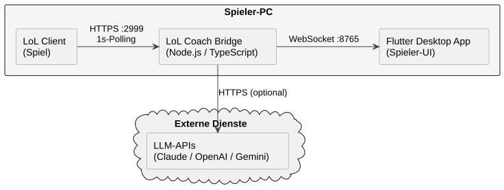

| Neighbour System | Relationship | Direction | Protocol |
|-----------------|-------------|-----------|----------|
| **Riot Live Client API** | Provides real-time game state (all players, items, gold, game time) | Bridge → API (pull, 1 s interval) | HTTPS GET |
| **Claude API (Anthropic)** | Generates natural-language item explanations | Bridge → Claude (push, optional, with cooldown) | HTTPS POST |
| **OpenAI API** | Alternative LLM provider | Bridge → OpenAI (push, optional) | HTTPS POST |
| **Google Gemini API** | Alternative LLM provider | Bridge → Gemini (push, optional) | HTTPS POST |
| **Flutter Desktop App** | Receives events and recommendations; sends configuration changes | Bridge ↔ App (bidirectional) | WebSocket |
| **OS Keychain** | Persistent, encrypted storage for API keys | App → OS (read/write) | OS API |

## Technical Context {#_technical_context}

| Channel | Protocol | Format | Port / Endpoint |
|---------|----------|--------|-----------------|
| Bridge → Riot API | HTTPS (GET) | JSON (Riot-proprietary) | 127.0.0.1:2999 |
| Bridge → LLM APIs | HTTPS (POST) | JSON (via SDKs) | api.anthropic.com, api.openai.com, generativelanguage.googleapis.com |
| Bridge ↔ Flutter App | WebSocket | JSON (AsyncAPI 2.6) | :8765 (configurable via `WS_PORT`) |
| App → OS Keychain | OS API | Binary (encrypted) | macOS Keychain / Windows DPAPI / Linux libsecret |

The complete WebSocket message protocol (message types, payloads, error handling) is specified in `core/asyncapi.yml`.

**Input/Output to channel mapping:**

| Information | Channel | Direction |
|-------------|---------|-----------|
| `AllGameData` (game state) | HTTPS :2999 | Inbound to Bridge |
| `GameEvent` (GAME_STARTED, ITEM_PURCHASED, …) | Bridge-internal | Internal routing |
| `ItemRecommendation` (LLM, `source: "llm"`) | WebSocket :8765 | Outbound from Bridge |
| `SET_SUMMONER`, `SET_LLM_PROVIDER` | WebSocket :8765 | Inbound to Bridge |
| API key (Anthropic/OpenAI/Google) | OS Keychain → App → WebSocket | App → Keychain → Bridge |

---

# Solution Strategy {#section-solution-strategy}

The following table summarises the key architectural decisions and their rationale. Details are documented in Section 9 (Architecture Decisions).

| Problem | Decision | Rationale | Quality Goal |
|---------|----------|-----------|--------------|
| How are game events detected? | State diff between two consecutive polls | Riot provides no event API; polling is the only option | Reliability |
| How are recommendations generated? | LLM-based, via a configurable provider | A single structured LLM analysis yields role- and matchup-aware advice; a response cache + cooldown bound the call rate | Maintainability, Cost Efficiency |
| How are multiple LLM providers supported? | Adapter pattern with a shared `LlmProvider` interface | Adding a new provider requires only one new file in `providers/` | Maintainability |
| How is the app distributed? | Bridge as native binary (pkg), Flutter as .exe/.app/.deb | No Node.js or Dart installation required on end-user machines | Usability |
| How is the process lifecycle managed? | Bridge receives the Flutter app's parent PID at startup | Bridge self-terminates when the parent app is closed | Usability |
| How are API keys stored securely? | `flutter_secure_storage` (OS keychain) | Prevents plaintext storage on the filesystem | Security |
| How are API boundaries validated? | Zod schemas at all system boundaries | Prevents runtime crashes on undocumented API changes | Reliability |
| How are LLM costs controlled? | 7-minute cooldown + state minification | Reduces token consumption from ~4,000 to ~200 characters per call | Cost Efficiency |

---

# Building Block View {#section-building-block-view}

## Whitebox Overall System {#_whitebox_overall_system}

The system consists of two independent processes communicating over a local WebSocket:

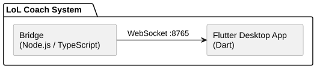

**Motivation:** Separating the Bridge (Node.js) from the Flutter App (Dart) allows the desktop UI and the polling/recommendation logic to be developed, tested, and restarted independently.

| Building Block | Responsibility |
|---------------|----------------|
| **Bridge** | Data acquisition from the Riot API, event detection, LLM-based recommendation generation, WebSocket server |
| **Flutter App** | User interface, connection management to the Bridge, display of game state and recommendations, API key management |

**Key interface:**

| Interface | Protocol | Schema |
|-----------|----------|--------|
| Bridge ↔ Flutter App | WebSocket JSON | `core/asyncapi.yml` |

## Level 2 — Bridge (Whitebox) {#_white_box_building_block_1}

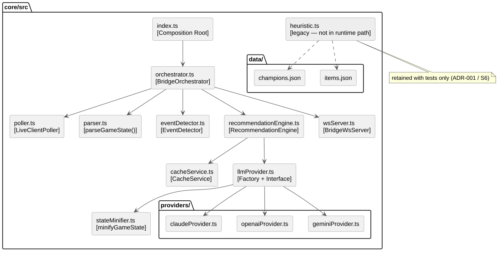

**Internal interfaces of the Bridge:**

| Interface | From | To | Type |
|-----------|------|----|------|
| `DataFetcher` | `LiveClientPoller` | Riot API | Async function |
| `AllGameData` | `LiveClientPoller` | `BridgeOrchestrator` | TypeScript interface (Zod-validated) |
| `ParsedGameState` | `parseGameState()` | `EventDetector`, `BridgeOrchestrator` | TypeScript interface |
| `GameEvent[]` | `EventDetector` | `BridgeOrchestrator` | Discriminated union |
| `ItemRecommendation` | `RecommendationEngine` (via `LlmProvider`) | `BridgeWsServer` | TypeScript interface |
| `WsMessage` | `BridgeWsServer` | Flutter App | JSON over WebSocket |
| `string` (minified) | `minifyGameState()` | `LlmProvider` | String (~200 characters) |

**Component descriptions:**

- **index.ts** (Composition Root): Initialises all components, processes CLI arguments (`--parent-pid`), starts the watchdog timer.
- **orchestrator.ts** (BridgeOrchestrator): Coordinates the full recommendation workflow; holds references to all sub-components.
- **poller.ts** (LiveClientPoller): Polls the Riot API every 1 second; tolerates up to `MAX_POLL_FAILURES = 3` consecutive failures before broadcasting `GAME_INACTIVE`.
- **parser.ts**: Normalises Riot API JSON into the internal `ParsedGameState` interface.
- **eventDetector.ts**: Detects game events by comparing two consecutive `ParsedGameState` snapshots.
- **recommendationEngine.ts** (RecommendationEngine): Gates the LLM call (`useLlm`), enforces the session token budget, consults the `CacheService`, validates returned item ids against Data Dragon, and emits the `ItemRecommendation` via callbacks.
- **cacheService.ts**: Caches LLM analyses keyed on `(state, riskLevel)` to avoid duplicate calls.
- **stateMinifier.ts**: Reduces game state to ~200 characters for LLM calls.
- **llmProvider.ts**: Factory and interface for LLM providers; creates the concrete provider instance.
- **heuristic.ts**: *Legacy* rule-based engine (`buildCompProfile` / `getHeuristicRecommendations`). No longer wired into the runtime path — retained with tests only (see ADR-001 and technical debt S6).
- **wsServer.ts** (BridgeWsServer): WebSocket server; manages connected clients; receives configuration messages.

## Level 2 — Flutter App (Whitebox) {#_white_box_building_block_2}

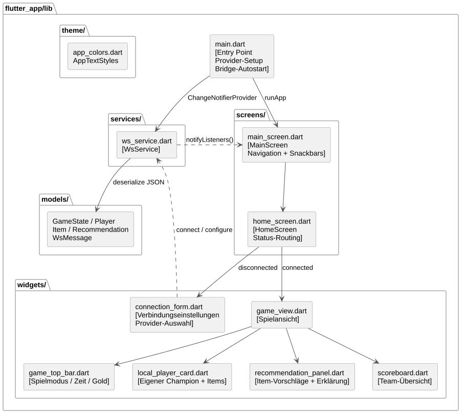

**Directory structure of `app/lib/`:**

```
app/lib/
│
├── main.dart               ← Entry point, provider setup, bridge auto-start
│
├── services/
│   └── ws_service.dart     ← [WsService extends ChangeNotifier]
│                              WebSocket client, state machine, auto-reconnect
│
├── screens/
│   ├── main_screen.dart    ← [MainScreen] bottom navigation, snackbar errors
│   └── home_screen.dart    ← [HomeScreen] coach tab, connection-state routing
│
├── widgets/
│   ├── connection_form.dart      ← Connection settings, provider selection
│   ├── game_view.dart            ← Main view during an active game
│   ├── game_top_bar.dart         ← Game mode, time, gold display
│   ├── local_player_card.dart    ← Own champion, stats, items
│   ├── recommendation_panel.dart ← Item suggestions + explanation
│   ├── scoreboard.dart           ← Team overview (allies / enemies)
│   └── shared_widgets.dart       ← Reusable UI components
│
├── models/
│   ├── game_state.dart
│   ├── player.dart
│   ├── active_player.dart
│   ├── item.dart
│   ├── recommendation.dart
│   └── ws_message.dart
│
└── theme/
    └── app_colors.dart     ← Central colour scheme (LoL dark theme)
```

**`WsService` state machine:**

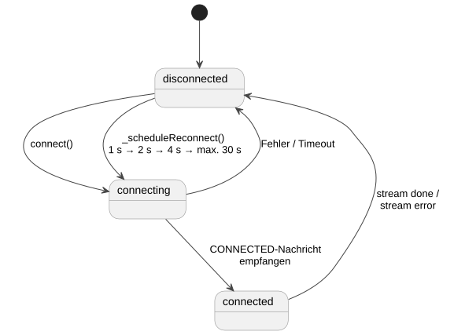

`WsService` implements a three-state machine (`disconnected`, `connecting`, `connected`) with an exponential backoff strategy for automatic reconnection (1 s → 2 s → 4 s → max. 30 s).

## Level 3 — LLM Providers (Whitebox) {#_white_box_building_block_3}

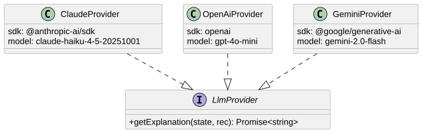

All three providers implement the shared `LlmProvider` interface:

```typescript
interface LlmProvider {
  getExplanation(state: string, rec: ItemRecommendation): Promise<string>;
}
```

**Shared characteristics of all providers:**

- Receive the same `SYSTEM_PROMPT` from `llmProvider.ts` (~300 tokens)
- Limited to 150 output tokens
- On error, `RecommendationEngine` emits a non-fatal `LLM_ERROR` broadcast and no recommendation is shown — the process never crashes
- Instantiated by the factory function `createLlmProvider(type, apiKey)`

| Provider | SDK | Model | Notes |
|---------|-----|-------|-------|
| `ClaudeProvider` | `@anthropic-ai/sdk` | `claude-haiku-4-5-20251001` | Native tool-use support |
| `OpenAiProvider` | `openai` | `gpt-4o-mini` | Chat Completions API |
| `GeminiProvider` | `@google/generative-ai` | `gemini-2.0-flash` | GenerativeModel API |

---

# Runtime View {#section-runtime-view}

## Scenario: Game Start with LLM Recommendation {#_runtime_scenario_1}

This scenario describes the most architecturally relevant flow: the Flutter app connects to the Bridge, a game starts, and the player receives an LLM-generated item recommendation. (For the full engine decision logic — budget, cache, Basic mode — see Scenario 5.)


**Notable aspects:**

- The connection is initiated by the Flutter app (client role)
- The `GAME_STARTED` event first broadcasts the game state, then the `RecommendationEngine` runs the LLM analysis and broadcasts `RECOMMENDATION_UPDATE`
- The recommendation is produced by the LLM (`source: "llm"`); with no provider configured this step is skipped and no `RECOMMENDATION_UPDATE` is sent

## Scenario: Enemy Purchases Item (State Update, No LLM) {#_runtime_scenario_2}

This scenario clarifies which events actually trigger an LLM recommendation. An enemy purchases an item and the `EventDetector` raises `ITEM_PURCHASED`: the orchestrator broadcasts the updated game state, but the `RecommendationEngine`'s `useLlm` gate fires **only** for `GAME_STARTED`, `PLAYER_DIED`, and `MANUAL` — so `ITEM_PURCHASED` (and `HIGH_GOLD_REACHED`) update the UI without spending an LLM call.


## Scenario: Connection Drop with Auto-Reconnect {#_runtime_scenario_3}

This scenario documents the error recovery behaviour when the WebSocket connection is lost. `WsService` implements exponential backoff.


**Notable aspects:**

- The Bridge detects the disconnection passively (stream end)
- Upon reconnect, the Bridge immediately pushes the last known game state
- The backoff timer resets after a successful reconnection

## Scenario: Bridge Auto-Start and Process Monitoring {#_runtime_scenario_4}

This scenario describes the process model: the Flutter app starts the Bridge as a child process and monitors its lifecycle.


**Notable aspects:**

- The Bridge receives the parent PID via `--parent-pid=<PID>` as a CLI argument
- The Bridge polls the parent PID every 2 seconds via `process.kill(pid, 0)`
- On Windows, `EPERM` (elevated integrity level mismatch) disables the watchdog (documented workaround)
- On normal app shutdown, the Bridge terminates itself cleanly

## Scenario: Recommendation Pipeline — Event to RECOMMENDATION_UPDATE {#_runtime_scenario_5}

This scenario details the current recommendation flow inside `BridgeOrchestrator` and `RecommendationEngine`: how a detected event becomes a `RECOMMENDATION_UPDATE`, and the decision points that can short-circuit it (no LLM provider, session token budget exhausted, cache hit, LLM error).

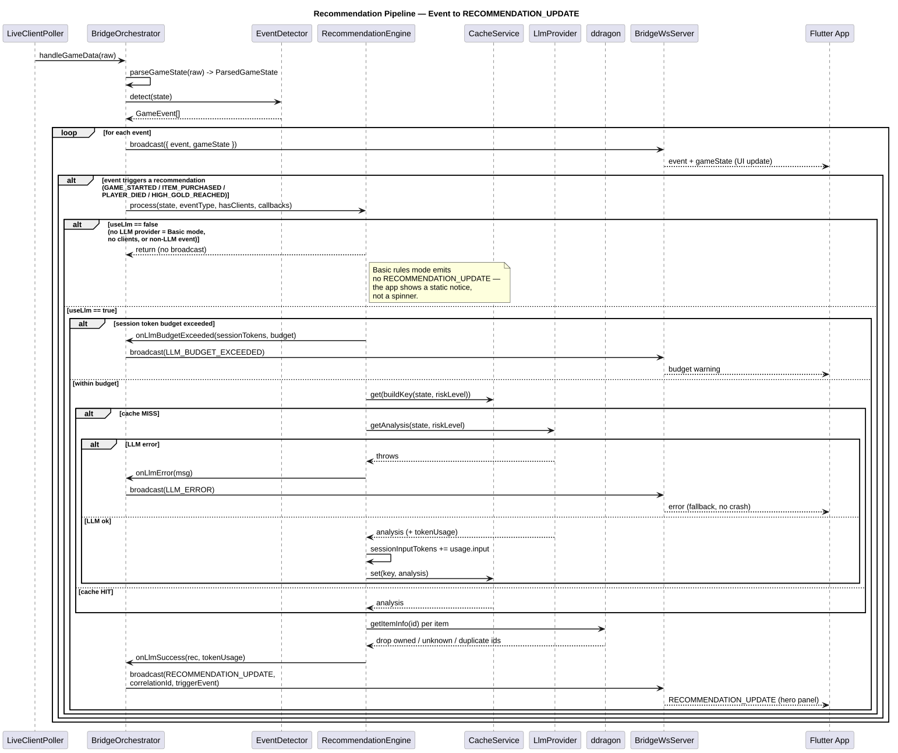

**Notable aspects:**

- `RECOMMENDATION_UPDATE` is broadcast **only** on the LLM-success path (`onLlmSuccess`). The recommendation payload is LLM-produced (`source: "llm"`); item ids are filtered against owned items and Data Dragon (`ddragon.getItemInfo`) to drop hallucinated or duplicate suggestions.
- **Basic rules mode** (`activeProviderType == 'none'`, i.e. no LLM provider configured): `RecommendationEngine.process` returns early at the `useLlm` gate and emits no `RECOMMENDATION_UPDATE` for the whole match. The Flutter app must therefore render a static notice in the recommendation slot, **not** a loading spinner that would never resolve.
- `CacheService` keys on `(state, riskLevel)`; a cache hit reuses a prior analysis and skips both the LLM call and any token spend.
- The session token budget (`OrchestratorConfig.tokenBudget`) is checked before the LLM call; on exhaustion the orchestrator broadcasts `LLM_BUDGET_EXCEEDED` and skips the call. `0` (default) means unlimited.
- LLM failures surface as a non-fatal `LLM_ERROR` broadcast; the process never crashes.

## Scenario: WebSocket Authentication Handshake {#_runtime_scenario_6}

This scenario documents the shared-secret authentication that protects the local WebSocket. On first start the Bridge generates a secret file; every client must present it as a Bearer token on the WS upgrade.

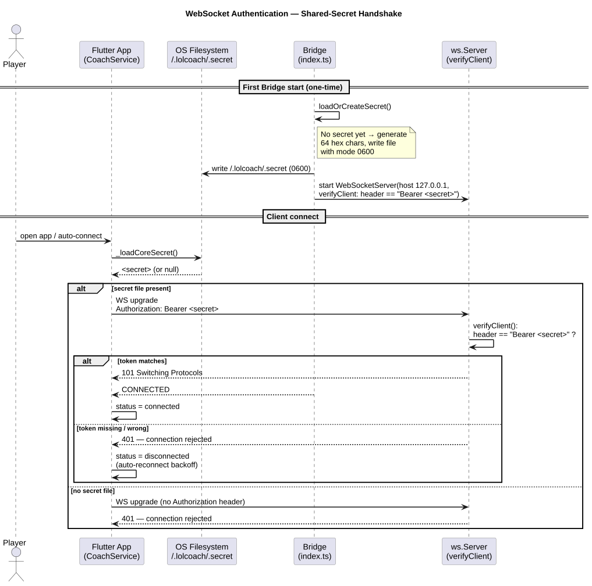

**Notable aspects:**

- On first run, `secretManager.ts` generates `~/.lolcoach/.secret` (mode `0600`, 64 hex chars) via `loadOrCreateSecret()`.
- The `WebSocketServer` is created with a `verifyClient` callback that accepts a connection only when the `Authorization` header equals `Bearer <secret>`.
- The Flutter `CoachService` reads the same file (`_loadCoreSecret()`) and attaches the Bearer header on connect; a missing or wrong token yields a rejected upgrade and the client falls back to its reconnect backoff.
- The secret value is never logged or transmitted off-machine.

---

# Deployment View {#section-deployment-view}

## Infrastructure Level 1 {#_infrastructure_level_1}

The entire system runs on the player's local machine. There is no cloud-side infrastructure beyond the external LLM APIs.


**Motivation:** Local execution protects player privacy — no game state data leaves the machine except for the optionally configured LLM calls (the only outbound traffic). Everything but the LLM analysis runs locally.

**Quality and performance characteristics of the infrastructure:**

| Characteristic | Value |
|---------------|-------|
| Latency Bridge ↔ App | < 1 ms (loopback WebSocket) |
| Latency Bridge ↔ Riot API | < 5 ms (loopback HTTPS) |
| Latency Bridge ↔ LLM | 500 ms – 3 s (internet, optional) |
| Bridge binary size | ~50 MB (Node.js runtime embedded) |
| Flutter app size | ~40 MB (Dart runtime embedded) |

**Mapping of building blocks to infrastructure:**

| Building Block | Infrastructure Element | Runtime Environment |
|---------------|----------------------|---------------------|
| Bridge | `bridge.exe` / `bridge` binary | Embedded Node.js runtime (via pkg) |
| Flutter App | `LoLCoach.exe` / `lol_coach.app` | Embedded Dart runtime |
| API Keys | OS Keychain | macOS Keychain / Windows DPAPI / Linux libsecret |

## Infrastructure Level 2 — Deployment Artefacts {#_infrastructure_level_2}

| Artefact | Platform | Generated by | Contents |
|---------|----------|-------------|----------|
| `LoLCoach.msix` | Windows | `deployment/build_installer.ps1` | Flutter app + `bridge.exe` (MSIX bundle, sideloading) |
| `LoLCoach-Mac.zip` | macOS | `deployment/build_unix.sh` | `lol_coach.app` + `bridge` binary (embedded in `.app` bundle) |
| `LoLCoach-Linux.tar.gz` | Linux | `deployment/build_unix.sh` | Flutter bundle + `bridge` binary (in app directory) |

On macOS and Linux the `bridge` binary is copied into the app bundle or app directory so that the Flutter app can locate it at a known relative path on startup.

## Build Pipeline (CI/CD) {#_infrastructure_level_3}


| Workflow | Trigger | Checks |
|---------|---------|--------|
| `ci.yml` | Push / PR on master | core — Node.js (`npm ci` + Jest, 226 tests); Flutter — `flutter analyze` + `flutter test --exclude-tags=golden` |
| `webpack.yml` | Push / PR | webpack bundle generation (`npm run bundle`) |
| `security.yml` | Push / PR / weekly | `npm audit --audit-level=high`, license check (no GPL/AGPL) |
| `codeql.yml` | Push / PR | CodeQL static analysis |
| `docs.yml` | Push / PR | TypeDoc API documentation generation |

Every change ships through a Pull Request; all of the above checks must be green before merge (see the `lolcoach-agents` skill → *Pull Request Workflow*).

---

# Cross-cutting Concepts {#section-concepts}

The following overview shows which concepts affect which building blocks:

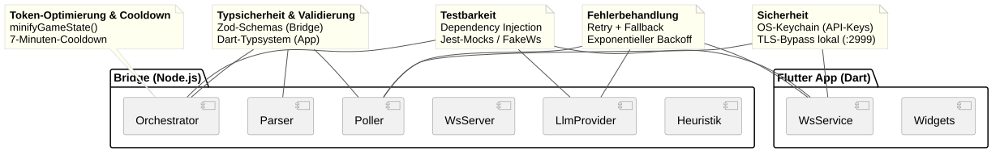

## Dependency Injection {#_concept_0}

Both processes wire their components through a real DI container rather than hand-rolled construction: **tsyringe** in the Bridge (constructor injection via `@inject()` tokens, resolved in the `index.ts` composition root) and **flutter_riverpod** in the app (provider definitions in `lib/providers.dart`). The Bridge bootstrap sequence is:

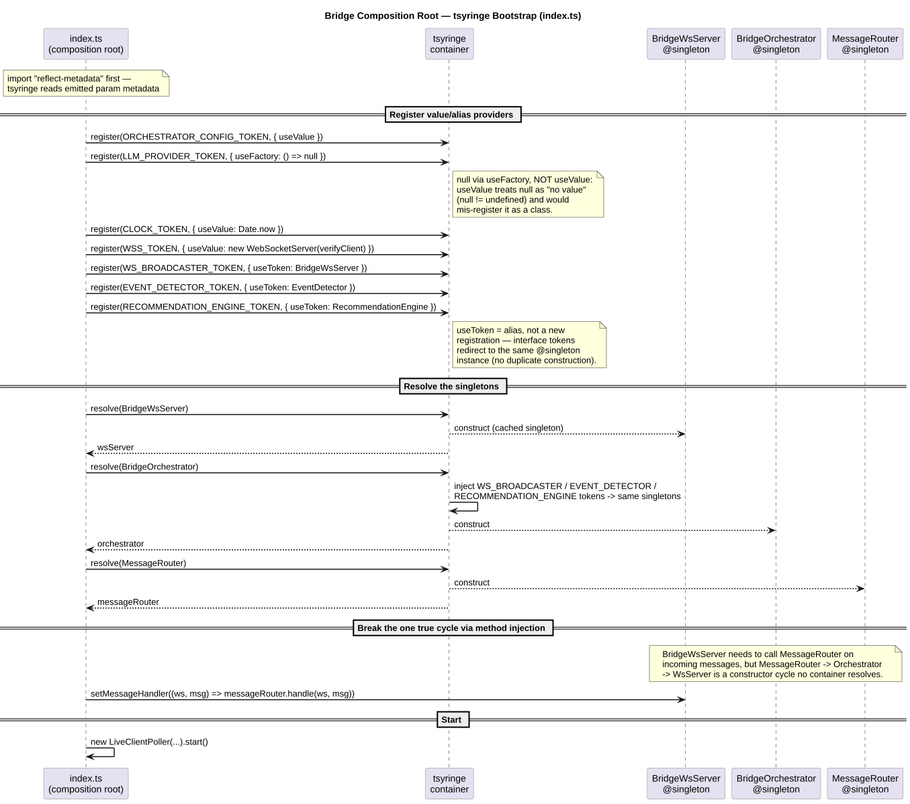

Three non-obvious rules govern the Bridge container — all enforced in `index.ts`:

- **Nullable tokens use `useFactory`, not `useValue`.** tsyringe's `useValue` provider treats `null` as "no value" (`null != undefined`) and would mis-register the token as a class to construct. `LLM_PROVIDER_TOKEN` is registered as `{ useFactory: () => null }`.
- **Interface tokens are `useToken` aliases, not `useClass`.** Registering an interface as `useClass` would construct a second, disconnected singleton; `useToken` redirects to the existing `@singleton` instance so there is exactly one of each.
- **The `BridgeWsServer` ↔ `MessageRouter` constructor cycle is broken by method injection.** Both are resolved through the container, then the single circular edge is wired explicitly via `wsServer.setMessageHandler(...)`.

> Under `tsx`/esbuild (`npm run dev`) no `design:paramtypes` metadata is emitted, so every constructor parameter is explicitly `@inject()`'d — a passing Jest suite does not prove the dev-mode process resolves correctly. Smoke-test DI changes with `npx tsx src/index.ts`.

## Type Safety and Validation {#_concept_1}

The system enforces static typing and runtime validation at every system boundary.

**Strategy:** Zod schemas validate all data received from the Riot API. Only typed objects are passed through the Bridge internals — no `any`, no unvalidated JSON.

```typescript
const parsed = AllGameDataSchema.safeParse(raw);
if (!parsed.success) {
  console.warn("[Poller] Unexpected data format:", parsed.error.issues[0]);
  return;
}
// From here: parsed.data is fully typed
```

The Flutter app uses the Dart type system with `fromJson` factory constructors on all model classes.

## Error Handling {#_concept_2}

| Layer | Strategy |
|-------|----------|
| Riot API polling | Transient failures are tolerated up to `MAX_POLL_FAILURES = 3` consecutive times; only then is `GAME_INACTIVE` broadcast |
| LLM API call | On failure, a non-fatal `LLM_ERROR` is broadcast and no recommendation is shown; the process does not crash |
| WebSocket connection (client) | Automatic reconnect with exponential backoff (1 s → 2 s → 4 s → max. 30 s) |
| Zod validation failure | Processing of the current message is aborted; polling continues |
| JSON parse error (WS) | `console.warn` with a truncated raw data excerpt; connection remains open |
| Bridge watchdog (EPERM) | On Windows EPERM, the watchdog is disabled; the application continues running |

## Security {#_concept_3}

| Measure | Implementation |
|---------|----------------|
| API key storage | `flutter_secure_storage` (macOS Keychain / Windows DPAPI / Linux libsecret) |
| WebSocket authentication | Shared secret in `~/.lolcoach/.secret` (mode `0600`, 64 hex chars, generated by `secretManager.ts`); the server's `verifyClient` rejects any upgrade whose `Authorization` header is not `Bearer <secret>`. The secret is never logged. |
| WebSocket binding | The server binds to `127.0.0.1` only (never `0.0.0.0`) — unreachable from other machines by design |
| TLS bypass (Riot API) | `rejectUnauthorized: false` only for `127.0.0.1:2999` — local loopback, no attack surface |
| API key transmission | Only over a local WebSocket connection (LAN); never transmitted externally |
| Dependency security | `npm audit` in CI; replaced `pkg` with `@yao-pkg/pkg` (fixes CVE GHSA-22r3-9w55-cj54) |
| License compliance | `license-checker-rseidelsohn` in CI; GPL/AGPL dependencies are rejected |
| No telemetry | No game state or usage data is transmitted to third parties (except optionally configured LLM APIs) |

## Testing Strategy {#_concept_4}

| Level | Technology | Coverage |
|-------|-----------|----------|
| Bridge unit tests | Jest + ts-jest | EventDetector, parser, heuristic, all LLM providers, poller, WsServer, orchestrator, stateMinifier |
| Bridge integration tests | Jest | 5 realistic game scenarios (losing / winning / scaling) |
| Flutter unit tests | flutter_test | WsService state machine, model deserialisation |
| Test infrastructure | `fixtures.ts`, `FakeWebSocketChannel` | Prebuilt test data; no real network access |

**Testing principles:**

- Dependency injection in all core classes (testability through constructor parameters)
- LLM providers are replaced by Jest mocks
- `clock: () => number` in `BridgeOrchestrator` enables deterministic time control in tests
- Golden tests for Flutter widgets (platform-specific; disabled on Ubuntu CI)

Current test status: **226 tests** across 21 Bridge suites (all passing).

## Token Optimisation (LLM) {#_concept_5}

Before every LLM call, the game state is compressed by `minifyGameState()`:

| Metric | Value |
|--------|-------|
| Input (Riot API JSON) | ~4,000 characters |
| Output (minified) | ~200 characters |
| Reduction | ~95 % |

```
Example output of minifyGameState():
  Time: 12:30
  Me: Ahri (Lvl 8, Gold: 1240, KDA: 3/1/2)
  My Items: Luden's Tempest, Sorcerer's Shoes
  Allies: Jinx (Lvl 7, KDA: 5/0/1), ...
  Enemies: Malphite (Lvl 8, KDA: 1/2/0), ...
```

Negative game times (loading screen) are clipped to `0:00`.

## LLM Cooldown {#_concept_6}

To prevent uncontrolled API costs, an LLM call is only triggered when **all** of the following conditions are met:

1. An LLM provider is configured
2. At least one Flutter client is connected
3. The event is `GAME_STARTED` — **or** —
   `PLAYER_DIED` **and** gold ≥ `HIGH_GOLD_THRESHOLD` (1,000) **and** the last LLM request was more than `DEFAULT_LLM_COOLDOWN_MS` (7 minutes) ago

## Configurability {#_concept_7}

| Parameter | Configuration Location | Default |
|-----------|----------------------|---------|
| WebSocket port | Environment variable `WS_PORT` | 8765 |
| Summoner name | `SUMMONER_NAME` (env) or WebSocket message `SET_SUMMONER` | (empty) |
| LLM provider | WebSocket message `SET_LLM_PROVIDER` or `ANTHROPIC_API_KEY` (env) | None |
| Champion classifications | `core/src/data/champions.json` | Bundled |
| Item names | `core/src/data/items.json` | Bundled |
| Heuristic thresholds | `champions.json → thresholds` | Bundled |
| LLM cooldown | `DEFAULT_LLM_COOLDOWN_MS` in `index.ts` | 7 minutes |
| Polling failure tolerance | `MAX_POLL_FAILURES` in `poller.ts` | 3 |

---

# Architecture Decisions {#section-design-decisions}

## ADR-001: LLM-Based Recommendations *(supersedes the original heuristic-first design)*

**Context:** The product originally shipped a rule-based heuristic engine that produced item recommendations offline, with the LLM as optional enrichment. In practice the heuristic advice was too generic (no role-, matchup-, or game-phase awareness), and the value of the product lies entirely in the context-aware LLM analysis.

**Decision:** Recommendations are now generated **solely by the LLM**. `RecommendationEngine` calls `LlmProvider.getAnalysis()` and broadcasts a single structured `ItemRecommendation` (`source: "llm"`). The heuristic engine (`heuristic.ts`) is no longer wired into the runtime path; it is retained with its tests pending a decision to remove it (see technical debt **S6**). Cost and latency are bounded by a response cache (`CacheService`), a session token budget, and an event/cooldown gate rather than by an offline fallback.

**Consequences:**

| | |
|---|---|
| (+) | Every recommendation is role- and matchup-aware; no generic fallback advice |
| (+) | Simpler single code path — one recommendation source, validated against Data Dragon |
| (−) | **No offline recommendations** — without a configured provider the app shows only live game state and the scoreboard (Basic rules mode) |
| (−) | Item advice latency depends on the LLM (cache + cooldown mitigate cost, not first-call latency) |
| (−) | `heuristic.ts` is now dead runtime code carrying maintenance/test weight until removed |

---

## ADR-002: Adapter Pattern for LLM Providers

**Context:** Three different LLM APIs (Anthropic, OpenAI, Google) must be interchangeable.

**Decision:** Shared `LlmProvider` interface with `getExplanation(state, rec): Promise<string>`. Factory function `createLlmProvider(type, apiKey)` creates the concrete implementation.

**Consequences:**

| | |
|---|---|
| (+) | A new provider requires only one new file in `providers/` |
| (+) | The orchestrator is fully decoupled from the concrete provider |
| (+) | Easily mockable in tests |
| (−) | Static import of all providers required (for webpack/pkg bundling) |

---

## ADR-003: WebSocket Instead of REST Polling from Flutter

**Context:** The Flutter app must continuously receive game state updates.

**Decision:** The Bridge runs a WebSocket server. Flutter acts as the client. Events are pushed, not polled.

**Consequences:**

| | |
|---|---|
| (+) | Real-time updates without polling overhead on the app side |
| (+) | Bidirectional communication (`SET_SUMMONER`, `SET_LLM_PROVIDER`) |
| (+) | Bridge-side filtering of unnecessary updates is possible |
| (−) | Connection management (reconnect, state recovery) must be handled on the client side |

---

## ADR-004: Process Model — Bridge as a Child Process

**Context:** The Bridge is a Node.js process; the Flutter app is a Dart runtime. Both must start and terminate together.

**Decision:** The Flutter app starts the Bridge via `Process.start()` passing `--parent-pid=<PID>`. The Bridge polls the parent PID every 2 seconds and self-terminates when the parent no longer exists.

**Consequences:**

| | |
|---|---|
| (+) | No manual Bridge startup required for end users |
| (+) | Automatic cleanup when the app is closed |
| (−) | On Windows, `process.kill(pid, 0)` may throw `EPERM` under different integrity levels (documented workaround available) |

---

## ADR-005: Distribution as Native Binaries via @yao-pkg/pkg

**Context:** End users have no Node.js runtime installed.

**Decision:** The Bridge is compiled into a platform-specific binary (`.exe`, macOS binary, Linux binary) using `@yao-pkg/pkg`. The binary embeds the full Node.js runtime and the webpack bundle.

**Consequences:**

| | |
|---|---|
| (+) | Zero-dependency installation for end users |
| (+) | Replaced `pkg` with `@yao-pkg/pkg` (actively maintained; fixes CVE GHSA-22r3-9w55-cj54) |
| (−) | Bundle size ~50 MB due to the embedded Node.js runtime |
| (−) | webpack must be configured with `minimize: false` (pkg compatibility requirement) |

---

## ADR-006: Zod for Runtime Validation at API Boundaries

**Context:** The Riot Live Client API is undocumented and may change at any time. Missing or incorrect fields would cause runtime crashes deep in the processing chain.

**Decision:** All incoming API data is validated through Zod schemas. Missing optional fields are handled via `.catch(defaultValue)`. Zod remains on version 3 (v4 migration not justified by breaking changes).

**Consequences:**

| | |
|---|---|
| (+) | No unexpected `undefined` errors deep in the code |
| (+) | End-to-end type safety from the network layer to business logic |
| (+) | The schema simultaneously documents the expected API structure |
| (−) | Minor validation overhead (negligible at a 1 s polling interval) |

---

## ADR-007: Champion and Item Data in JSON Configuration Files

**Context:** Champion classifications and item names were hardcoded as TypeScript constants. Meta changes required a code deployment.

**Decision:** Extracted to `core/src/data/champions.json` and `core/src/data/items.json`. TypeScript imports these files statically (`resolveJsonModule: true`); webpack bundles them into the binary.

**Consequences:**

| | |
|---|---|
| (+) | Meta updates are possible without a code change (edit JSON, re-bundle) |
| (+) | Thresholds are named and self-documenting |
| (−) | JSON is baked statically into the binary; runtime replacement without restart is not possible |

---

# Quality Requirements {#section-quality-scenarios}

## Quality Tree {#_quality_requirements_overview}

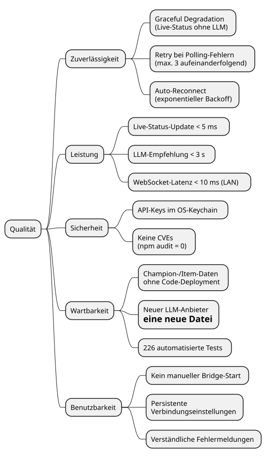

## Quality Scenarios {#_quality_scenarios}

The following scenarios make the quality goals from Section 1.2 concrete and measurable:

| ID | Quality Attribute | Context / Stimulus | System Response | Metric / Acceptance Criterion |
|----|------------------|--------------------|-----------------|-------------------------------|
| Q1 | Reliability | LLM call fails or no provider is configured during a game | Live game state and scoreboard keep updating; a non-fatal `LLM_ERROR` (or nothing, in Basic mode) is sent instead of a crash | No process crash; UI shows live state; advice slot shows a non-loading notice |
| Q2 | Performance Efficiency | `GAME_STARTED` event is detected | Game state is broadcast immediately; the LLM recommendation follows asynchronously | Game-state broadcast < 5 ms after event detection; LLM advice < 3 s |
| Q3 | Fault Tolerance | Riot API does not respond twice in a row | `GAME_INACTIVE` is not broadcast | Only after 3 consecutive failures (`MAX_POLL_FAILURES`) |
| Q4 | Fault Tolerance | WebSocket connection drops | App reconnects automatically without user interaction | First reconnect attempt after 1 s; full reconnect logic covered by tests |
| Q5 | Security | Attacker reads the user's filesystem | API key is not present as plaintext | `flutter_secure_storage` uses OS keychain; no plaintext in `SharedPreferences` |
| Q6 | Maintainability | Riot releases a new patch (new champion) | Champion classification is updated | Edit JSON file and re-bundle; no TypeScript code deployment required |
| Q7 | Testability | Developer adds a new LLM provider | New file in `providers/`; no changes to the orchestrator | New provider implements `LlmProvider` interface; extend factory function |
| Q8 | Usability | Player launches the app for the first time | Bridge starts automatically; UI shows connection status | No manual Bridge start required; error message shown if Bridge binary is missing |

---

# Risks and Technical Debt {#section-technical-risks}

## Risks

| ID | Risk | Probability | Impact | Mitigation |
|----|------|-------------|--------|------------|
| R1 | **Riot changes the Live Client API without notice** (undocumented) | Medium | High — poller receives no valid data | Quickly adapt Zod schemas; CI alert on validation errors in logs |
| R2 | **LLM API costs increase unexpectedly** | Low | Medium — usage becomes uneconomical | Cooldown mechanism and token minimisation in place; provider can be switched at any time |
| R3 | **`@yao-pkg/pkg` is abandoned** | Low | Medium — native binary builds no longer possible | Fork or switch to `nexe` as an alternative; webpack bundle remains portable |
| R4 | **Windows EPERM bug in the watchdog** | Low | Low — Bridge incorrectly self-terminates under elevated privileges | Documented in `index.ts`; workaround: start Bridge manually via terminal |
| R5 | **Riot blocks the Live Client API for third-party applications** | Low | Very High — entire core feature breaks | No technical workaround possible; monitor the API Terms of Service continuously |

## Technical Debt

| ID | Debt | Priority | Effort | Description |
|----|------|----------|--------|-------------|
| S1 | **Static champion classifications** | High | Medium | AP/CC/healer lists do not cover all champions and ignore build variations (e.g. AP Corki). Mid-term solution: load data from Data Dragon or a community API. |
| S2 | **Incomplete Flutter widget tests** | High | Medium | `GameView`, `RecommendationPanel`, and `Scoreboard` lack meaningful test coverage. Refactoring safety net is missing. |
| S3 | **No E2E test (Bridge + App)** | Medium | High | The Bridge–Flutter integration is only manually tested. An automated E2E test would detect regressions early. |
| S4 | **Fragile relative paths in `build_unix.sh`** | Low | Low | `cd`-based relative paths are error-prone. Switching to absolute paths via `$(dirname "$0")` would prevent path errors structurally. |
| S5 | **Jest 29 + ts-jest 29 — coordinated upgrade pending** | Low | Low | Jest 30 + ts-jest 30 are available but must be upgraded together. No functional impact. TypeScript stays on ~5.8 (TS 6 migration risk). |
| S6 | **Dead heuristic engine** | Medium | Low | `heuristic.ts` (`buildCompProfile` / `getHeuristicRecommendations`) is no longer wired into the runtime path (LLM-only since ADR-001) but is still maintained and tested. Decide whether to remove it or restore it as an offline fallback. |

---

# Glossary {#section-glossary}

| Term | Definition |
|------|-----------|
| **ADC** | *Attack Damage Carry* — champion role focused on dealing physical damage |
| **AP** | *Ability Power* — magical damage source in League of Legends |
| **AD** | *Attack Damage* — physical damage source in League of Legends |
| **arc42** | Architecture documentation template by Dr. Peter Hruschka and Dr. Gernot Starke; Version 9.0, July 2025 |
| **AsyncAPI** | Specification standard for event-driven APIs (analogous to OpenAPI for REST); Version 2.6 |
| **Bridge** | The Node.js/TypeScript process that mediates between the Riot API and the Flutter app |
| **CC** | *Crowd Control* — abilities that slow, stun, or immobilise enemies |
| **CompProfile** | Internal data structure describing the composition of the enemy team (AP ratio, AD ratio, CC score, heal score) |
| **Cooldown** | Wait time between two consecutive LLM calls (default: 7 minutes = `DEFAULT_LLM_COOLDOWN_MS`) |
| **Data Dragon** | Official static data source from Riot Games for item and champion information |
| **EventDetector** | Bridge component that detects game events by comparing two consecutive `ParsedGameState` snapshots |
| **GameEvent** | Typed event in the Bridge (e.g. `GAME_STARTED`, `ITEM_PURCHASED`, `PLAYER_DIED`, `GAME_INACTIVE`) |
| **Heuristic** | *Legacy* rule-based item recommendation system (`heuristic.ts`) with no external API dependency. No longer in the runtime path — recommendations are LLM-based since ADR-001 |
| **iSAQB** | *International Software Architecture Qualification Board* — certification body for software architects |
| **Live Client API** | Local HTTP server embedded in the League of Legends client at `https://127.0.0.1:2999`, providing real-time game state |
| **LLM** | *Large Language Model* — AI model for natural-language text generation (Claude, GPT-4o, Gemini) |
| **LlmProvider** | TypeScript interface and adapter pattern for all supported LLM providers |
| **minifyGameState** | Function that reduces game state to a compact string (~200 characters) to minimise LLM token costs |
| **MSIX** | Windows app package format for Microsoft Store distribution and sideloading |
| **ParsedGameState** | Normalised game state produced by the parser — the base structure for all downstream components |
| **pkg / @yao-pkg/pkg** | Tool for compiling Node.js applications into platform-specific binaries (including embedded runtime) |
| **riverpod (Flutter)** | Dependency-injection / state framework used in the app. Services remain plain `ChangeNotifier`s; riverpod's `Provider` manages their construction and lifecycle. Defined in `app/lib/providers.dart` |
| **tsyringe (Bridge)** | Constructor-injection DI container for the Bridge. Components are `@singleton()`-decorated and resolved in the `index.ts` composition root |
| **Retry with Backoff** | Error recovery strategy: retry attempts with exponentially increasing wait times |
| **WsMessage** | Shared JSON message format between Bridge and Flutter app over WebSocket (specified in `asyncapi.yml`) |
| **WsService** | Flutter service (`ChangeNotifier`) managing the WebSocket connection to the Bridge; implements a state machine with auto-reconnect |
| **Zod** | TypeScript library for schema declaration and runtime validation; Version 3 (intentionally not migrated to v4) |
