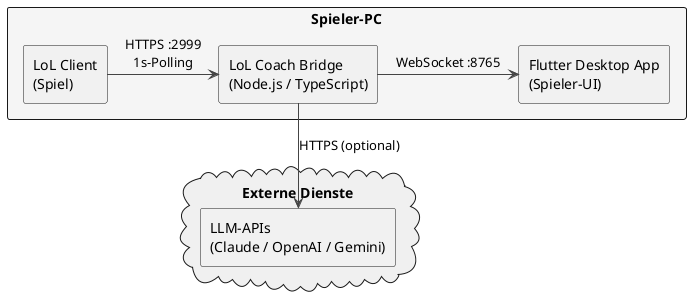

## 3. Kontextabgrenzung

### 3.1 Fachlicher Kontext

| Nachbarsystem | Beziehung | Richtung |
|---------------|-----------|----------|
| **Riot Live Client API** | Liefert Echtzeit-Spielzustand (alle Spieler, Items, Gold, Spielzeit) | Bridge → API (Pull, 1 s Intervall) |
| **Claude API (Anthropic)** | Generiert natürlichsprachige Item-Erklärungen | Bridge → Claude (Push, optional, mit Cooldown) |
| **OpenAI API** | Alternativer LLM-Anbieter | Bridge → OpenAI (Push, optional) |
| **Google Gemini API** | Alternativer LLM-Anbieter | Bridge → Gemini (Push, optional) |
| **Flutter Desktop App** | Empfängt Events und Empfehlungen; sendet Konfigurationsänderungen | Bridge ↔ App (WebSocket, bidirektional) |

### 3.2 Technischer Kontext

| Kanal | Protokoll | Format | Port |
|-------|-----------|--------|------|
| Bridge → Riot API | HTTPS (GET) | JSON | 2999 |
| Bridge → LLM-APIs | HTTPS (POST) | JSON (SDK) | 443 |
| Bridge ↔ Flutter App | WebSocket | JSON (AsyncAPI 2.6) | 8765 (konfigurierbar) |

Das WebSocket-Protokoll ist in `bridge/asyncapi.yml` vollständig spezifiziert.

---
