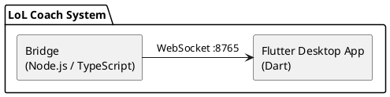
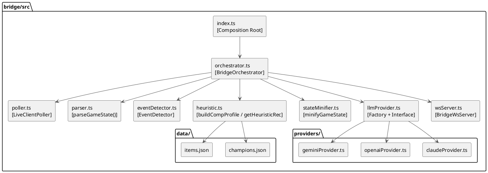
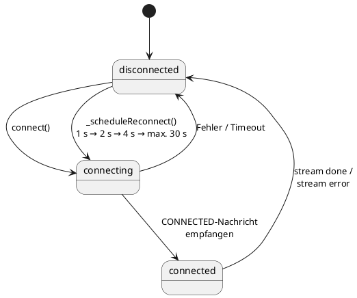
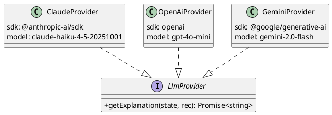

## 5. Bausteinsicht

### 5.1 Ebene 1 — Gesamtsystem



| Baustein | Verantwortung |
|---------|---------------|
| **Bridge** | Datenbeschaffung, Ereigniserkennung, Empfehlungsgenerierung, WebSocket-Server |
| **Flutter App** | Benutzeroberfläche, Verbindungsverwaltung, Darstellung von Spielzustand und Empfehlungen |

### 5.2 Ebene 2 — Bridge (Whitebox)



**Schnittstellenübersicht Bridge-intern:**

| Schnittstelle | Von | Nach | Typ |
|--------------|-----|------|-----|
| `DataFetcher` | `LiveClientPoller` | extern (Riot API) | Async-Funktion |
| `AllGameData` | `LiveClientPoller` | `BridgeOrchestrator` | TypeScript-Interface (Zod-validiert) |
| `ParsedGameState` | `parseGameState()` | `EventDetector`, `BridgeOrchestrator` | TypeScript-Interface |
| `GameEvent[]` | `EventDetector` | `BridgeOrchestrator` | Discriminated Union |
| `ItemRecommendation` | `heuristic.ts` / `LlmProvider` | `BridgeWsServer` | TypeScript-Interface |
| `WsMessage` | `BridgeWsServer` | Flutter App | JSON over WebSocket |

### 5.3 Ebene 2 — Flutter App (Whitebox)

```
flutter_app/lib/
│
├── main.dart               ← Entry Point, Provider-Setup, Bridge-Autostart
│
├── services/
│   └── ws_service.dart     ← [WsService extends ChangeNotifier]
│                              WebSocket-Client, State-Machine, Auto-Reconnect
│
├── screens/
│   ├── main_screen.dart    ← [MainScreen] Bottom-Navigation, Snackbar-Fehler
│   └── home_screen.dart    ← [HomeScreen] Coach-Tab, Status-Routing
│
├── widgets/
│   ├── connection_form.dart      ← Verbindungseinstellungen, Provider-Auswahl
│   ├── game_view.dart            ← Hauptansicht während Spiel
│   ├── game_top_bar.dart         ← Spielmodus, Zeit, Gold
│   ├── local_player_card.dart    ← Eigener Champion, Stats, Items
│   ├── recommendation_panel.dart ← Item-Vorschläge + Erklärung
│   ├── scoreboard.dart           ← Teamansicht (Allies / Enemies)
│   └── shared_widgets.dart       ← Wiederverwendbare UI-Komponenten
│
├── models/
│   ├── game_state.dart
│   ├── player.dart
│   ├── active_player.dart
│   ├── item.dart
│   ├── recommendation.dart
│   └── ws_message.dart
│
└── theme/
    └── app_colors.dart     ← Zentrales Farbschema (LoL-Dark-Theme)
```

**State-Machine `WsService`:**



### 5.4 Ebene 3 — LLM Provider (Whitebox)



Alle drei Provider:
- erhalten denselben `SYSTEM_PROMPT` aus `llmProvider.ts`
- sind auf 150 Output-Tokens limitiert
- fallen bei Fehler auf die heuristische `reasoning`-Zeichenkette zurück

---
