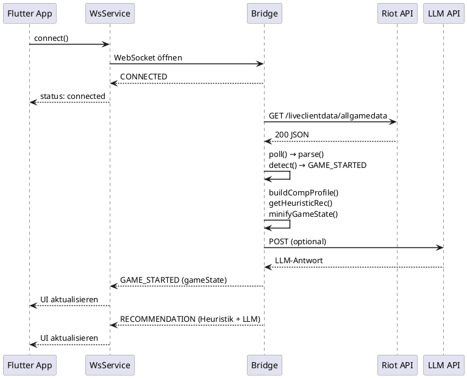
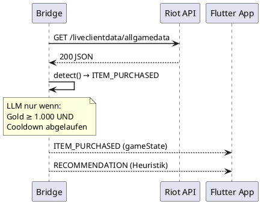
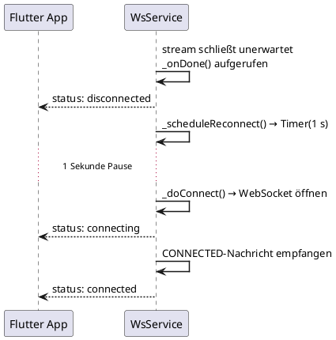
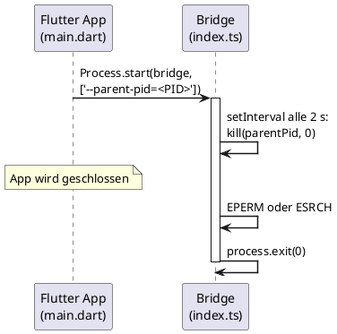

## 6. Laufzeitsicht

### 6.1 Szenario: Spielstart mit LLM-Empfehlung

### 6.2 Szenario: Feind kauft Item (Heuristik-only)

### 6.3 Szenario: Verbindungsabbruch mit Auto-Reconnect

### 6.4 Szenario: Bridge-Autostart und Prozessüberwachung

---
