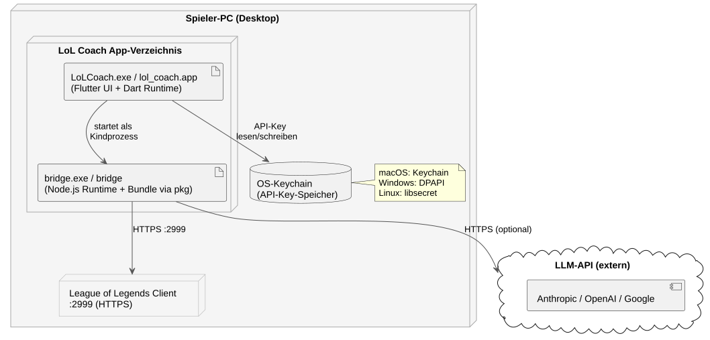
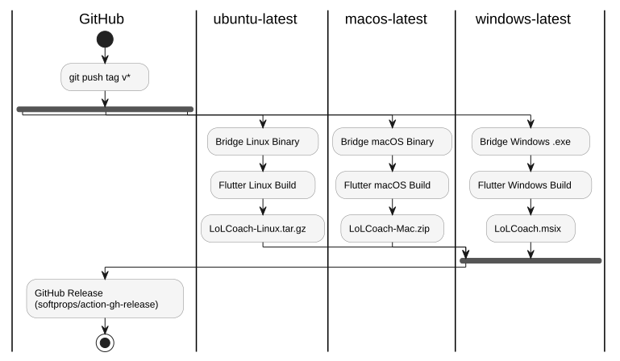

## 7. Verteilungssicht

### 7.1 Infrastrukturübersicht

### 7.2 Deployment-Artefakte

| Artefakt | Plattform | Erzeugung | Inhalt |
|---------|-----------|-----------|--------|
| `LoLCoach.msix` | Windows | `deployment/build_installer.ps1` | Flutter-App + `bridge.exe` (via MSIX-Bundle) |
| `LoLCoach-Mac.zip` | macOS | `deployment/build_unix.sh` | `lol_coach.app` + `bridge` Binary (im .app-Bundle) |
| `LoLCoach-Linux.tar.gz` | Linux | `deployment/build_unix.sh` | Flutter-Bundle + `bridge` Binary |

### 7.3 Build-Pipeline (CI/CD)

**Zusätzliche Workflows:**

| Workflow | Trigger | Prüfung |
|---------|---------|--------|
| `ci.yml` | Push / PR | TypeScript-Build, Jest-Tests |
| `security.yml` | Push / PR / wöchentlich | `npm audit --audit-level=high`, License-Check |
| `webpack.yml` | Push / PR | webpack-Bundle |
| `docs.yml` | Push / PR | TypeDoc-Generierung |

---
