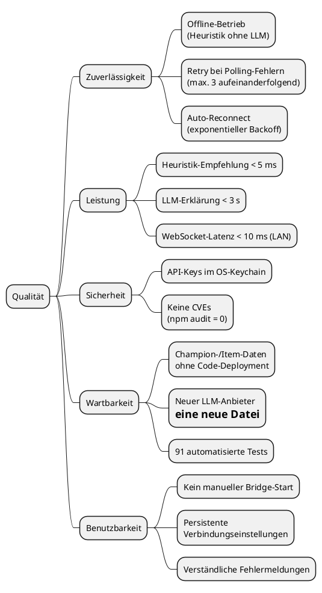

## 10. Qualitätsanforderungen

### 10.1 Qualitätsbaum

### 10.2 Qualitätsszenarien

| ID | Qualitätsmerkmal | Stimulus | Reaktion | Messbar |
|----|-----------------|----------|----------|---------|
| Q1 | Verfügbarkeit | Internetzugang fällt aus | Heuristik liefert weiterhin Empfehlungen | Heuristik-Empfehlung erscheint in < 5 ms |
| Q2 | Leistung | `GAME_STARTED`-Ereignis tritt auf | Heuristik-Empfehlung wird gebroadcastet | < 5 ms nach Ereigniserkennung |
| Q3 | Fehlertoleranz | Riot-API antwortet 2× nicht | Kein `GAME_INACTIVE` gebroadcastet | Erst nach 3 aufeinanderfolgenden Fehlern |
| Q4 | Fehlertoleranz | WebSocket-Verbindung bricht ab | App reconnectet automatisch | Erste Reconnect-Versuch nach 1 s |
| Q5 | Sicherheit | Angreifer liest Dateisystem des Nutzers | API-Key ist nicht als Klartext vorhanden | `flutter_secure_storage` verwendet OS-Keychain |
| Q6 | Wartbarkeit | Riot veröffentlicht neuen Patch (neuer Champion) | Champion-Klassifikation wird aktualisiert | JSON-Datei editieren; kein TypeScript-Deployment |
| Q7 | Testbarkeit | Entwickler fügt neuen LLM-Provider hinzu | Neue Datei in `providers/`; keine Änderung in Orchestrator | Neuer Provider implementiert `LlmProvider`-Interface |

---
